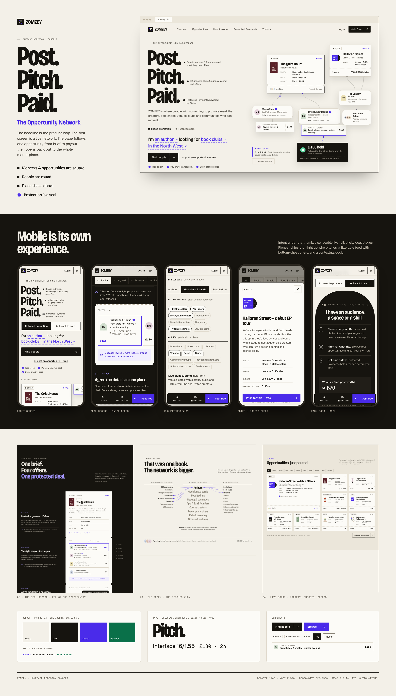

# ZOMZEY — homepage redesign concept

**"Post. Pitch. Paid." — The Opportunity Network.**
A contest concept for the zomzey.io homepage: desktop + mobile homepage, refined logo system,
design system / style guide, rationale and presentation board. Static HTML/CSS/JS, no build step,
no runtime dependencies.

**v1.1 — polish pass:** refined (de-condensed) typography, calmer hero, tighter page rhythm, compact
deal journey, network index as a centrepiece, simplified board cards, balanced "two ways in", tuned
mobile first screen and swipe rails, and a refined logo system. See [`docs/05-polish-pass.md`](docs/05-polish-pass.md).



## Run it

```bash
npm run dev        # → http://localhost:4310  (steps to the next free port if 4310 is busy)
PORT=8080 npm run dev
```

| Page | Path |
|---|---|
| Homepage | `/` (`index.html`) |
| Style guide | `/styleguide.html` |
| Presentation board | `/board.html` |

Optional tooling (needs `npm install` for axe-core, plus Playwright with Chromium):

```bash
npm run qa         # overflow sweep 320–2560, axe, keyboard, reduced motion, perf → docs/qa-results.json
npm run capture    # regenerates everything in screenshots/
```

## Read this first
1. [`docs/03-rationale.md`](docs/03-rationale.md) — client-facing walkthrough (concept, layout, intents, mobile, interactions)
2. [`docs/01-audit.md`](docs/01-audit.md) — audit of the current site, terminology and UX weaknesses
3. [`docs/02-creative-direction.md`](docs/02-creative-direction.md) — three directions compared, shape grammar, visual system
4. [`docs/04-qa-report.md`](docs/04-qa-report.md) — QA results and fixes
5. [`docs/05-polish-pass.md`](docs/05-polish-pass.md) — v1.1 polish pass: what changed and why

## Screenshots
| | |
|---|---|
| Desktop first viewport | `screenshots/desktop-1440-first-viewport.png` |
| Desktop full page | `screenshots/desktop-1440-full.png` |
| Mobile first viewport (3×) | `screenshots/mobile-390-first-viewport.png` |
| Mobile full page (2×) | `screenshots/mobile-390-full.png` |
| Style guide | `screenshots/styleguide-1440-full.png` |
| Presentation board | `screenshots/board.png` |
| Section crops | `screenshots/sections/` |
| Interaction states | `screenshots/interactions/` |
| 768 / 1024 / 1280 / 1920 / 2560, reduced motion | `screenshots/responsive/` |

## Structure
```
index.html            homepage
styleguide.html       design system page
board.html            presentation board (renders screenshots/)
assets/css/tokens.css colour, type, space, shape, motion tokens
assets/css/base.css   shared components (buttons, tags, status, avatars, slips, members, offers, forms)
assets/css/home.css   homepage layout + responsive/mobile design
assets/js/home.js     interactions (progressive enhancement)
assets/fonts/         Bricolage Grotesque, Geist, Geist Mono (OFL, self-hosted)
assets/img/logo/      refined logo: horizontal light/dark, mark light/dark, favicon cut, 512 icon, "before"
assets/img/           favicon.svg, apple-touch-icon.png (+ favicon.ico at the root)
scripts/              dev server, QA, capture
```
The SVG icon/artefact sprite is inlined in `index.html` and copied into `styleguide.html` and
`board.html`; edit it in `index.html` and copy it across.
